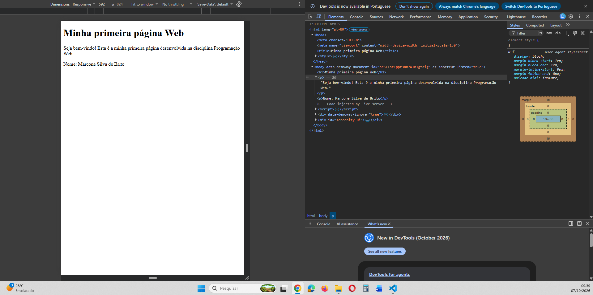
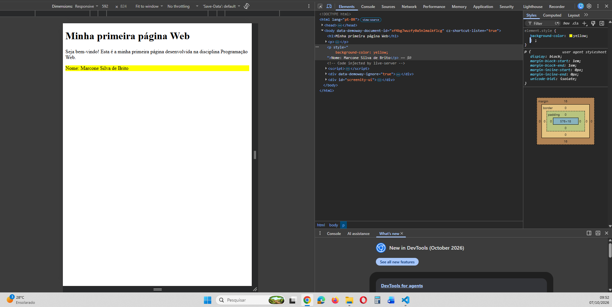
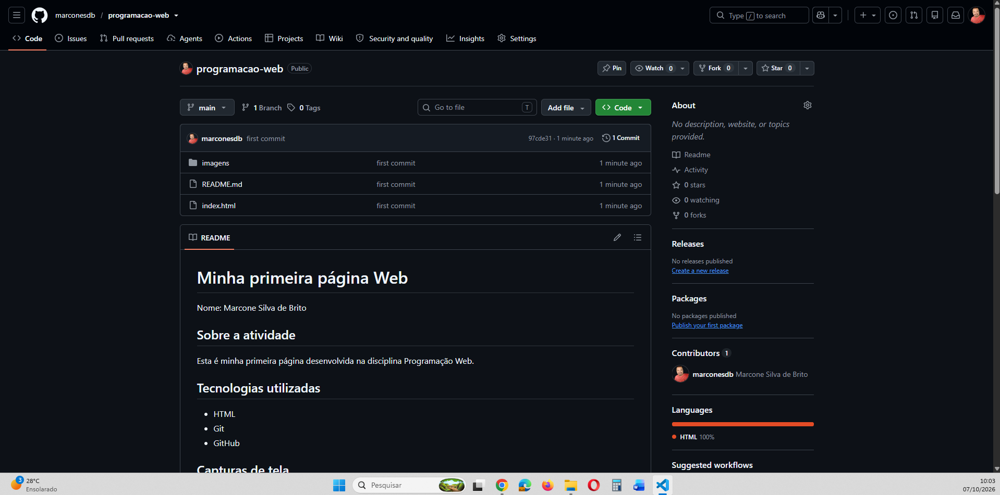

# Minha primeira página Web

Nome: Marcone Silva de Brito

## Sobre a atividade

Esta é minha primeira página desenvolvida na disciplina Programação Web.

## Tecnologias utilizadas

- HTML
- Git
- GitHub

## Capturas de tela

### Página no navegador

### Página no navegador alterada no DevTools

### Repositório no GitHub
